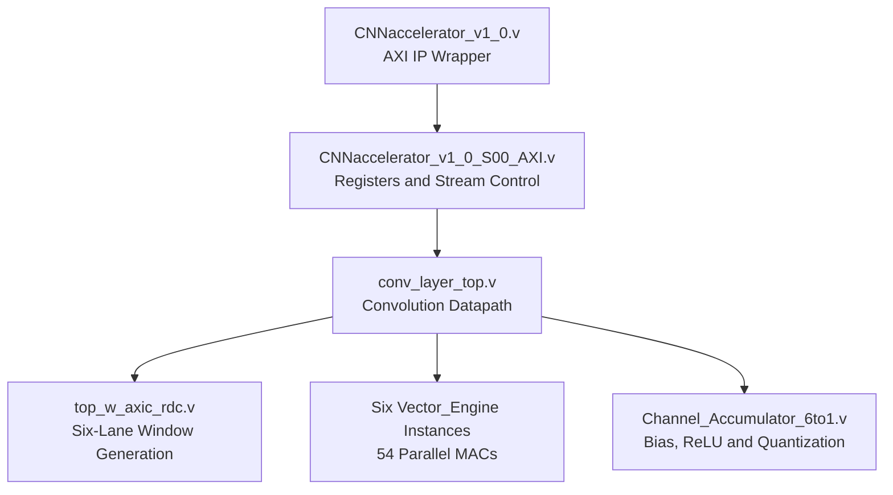
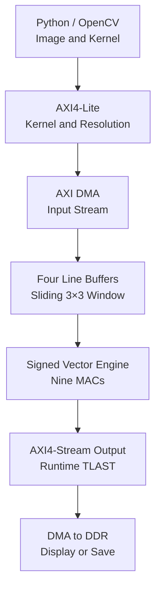
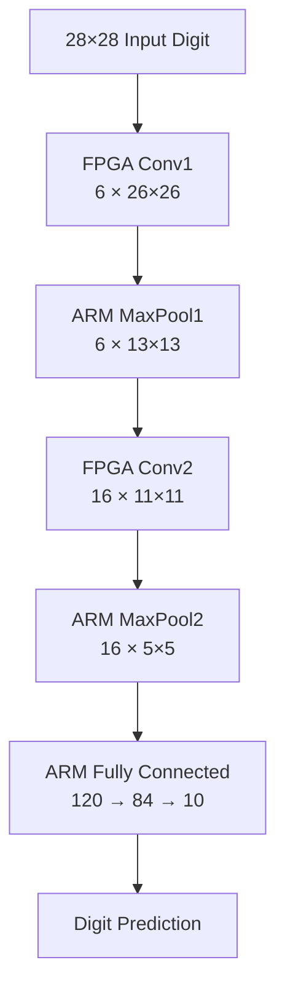
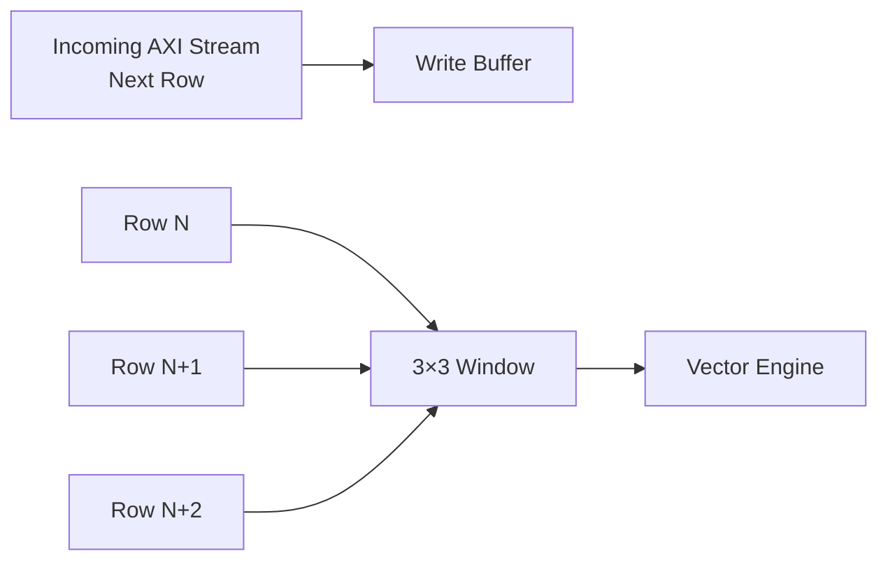

# CoreVision: Heterogeneous SoC CNN Accelerator

## Overview

CoreVision is a hardware-software co-design project that implements custom convolution and CNN acceleration on the **Xilinx PYNQ-Z2 SoC**. The repository now contains two related accelerator generations:

1. A configurable **signed 2D convolution accelerator** for edge detection, Gaussian blurring, and other image-processing kernels.
2. A **LeNet-5 CNN accelerator** with six parallel vector engines, runtime-configurable AXI4-Lite control, and AXI4-Stream DMA integration.

The original 2D accelerator demonstrates low-latency FPGA image processing, BRAM-based line buffering, signed convolution, and optimized DMA buffer management. The LeNet-5 design extends the same hardware-software approach to execute Conv1 and Conv2 on the FPGA while pooling and fully connected layers run on the ARM/Python side.

---

## Table of Contents
- [Key Features](#key-features)
- [Architecture](#architecture)
- [Data Flow](#data-flow)
- [Repository Structure](#repository-structure)
- [Implementation Timeline](#implementation-timeline)
- [Challenges & Solutions](#challenges--solutions)
- [Results/Benchmarks](#resultsbenchmarks)
- [Resource Utilization](#resource-utilization)
- [Current Status](#current-status)
- [Setup & Usage](#setup--usage)

---

## Key Features

- **Two Accelerator Generations:** The repository preserves the original configurable 2D image-processing accelerator and adds the current LeNet-5 CNN implementation in separate RTL, software, testbench, IP, and result directories.
- **Six Parallel Vector Engines:** The LeNet-5 datapath uses six parallel 3×3 vector engines, providing 54 DSP-backed MAC operations across the six lanes. Compared with the single-engine BRAM design, this increases parallel MAC capacity by 6× while LUT usage decreases from 4,839 to 4,334 and BRAM usage increases only from 11 to 12.
- **Layer-Reconfigurable CNN Datapath:** The same accelerator supports Conv1 and Conv2 through runtime configuration. Conv1 processes six filters in parallel, while Conv2 accumulates six input channels for each output filter.
- **AXI4-Stream DMA Pipeline:** Input feature maps are streamed from DDR through Xilinx AXI DMA into the accelerator, and the output feature maps are returned to DDR without CPU-managed pixel-by-pixel transfers.
- **AXI4-Lite Runtime Control:** Weights, biases, operating mode, quantization shift, active image width, and expected output-beat count are configured at runtime without rebuilding the bitstream.
- **Five-Stage Output Pipeline:** The LeNet-5 output stage supports channel accumulation, bias addition, ReLU, requantization, clamping, and bypass modes for different convolution layers and debugging flows.
- **Variable-Width Processing:** The LeNet-5 design operates directly on the required 28×28 and 13×13 feature-map widths instead of padding every layer to 256×256.
- **Hardware-Software Co-Design:** Conv1 and Conv2 run in programmable logic, while max-pooling, fully connected layers, image preprocessing, and prediction run on the ARM/Python side.
- **Native Signed Arithmetic:** Both accelerator generations support signed convolution weights directly in hardware.
- **Reusable DMA Buffers:** The optimized software paths preallocate physically contiguous PYNQ buffers and reuse them across inference calls.

---

## Architecture

The project divides execution between the ARM processing system and the FPGA programmable logic.

**1. Software Orchestrator (ARM Cortex-A9 / Python)**  
Handles image acquisition, preprocessing, model parameter loading, AXI4-Lite configuration, DMA buffer management, pooling, fully connected layers, and output visualization.

**2. Hardware Accelerator (Programmable Logic / Verilog)**  
Handles line buffering, sliding-window generation, signed 3×3 convolution, multi-engine execution, channel accumulation, activation, requantization, and AXI4-Stream output control.

### LeNet-5 Hardware Module Hierarchy



### Convolution Datapath

Each of the six lanes receives an 8-bit input channel through the 64-bit AXI4-Stream interface. The buffering stage produces six independent 3×3 windows, which are processed by six vector engines in lockstep.

For Conv1, the six engines apply six different filters to the same input image and return six output feature maps in parallel. For Conv2, the six engines process the six input channels of one output filter, and the channel accumulator combines their partial sums before bias, ReLU, and requantization.

---

## Data Flow

### Original 2D Processing Flow



### LeNet-5 Inference Flow



The FPGA is reconfigured through AXI4-Lite registers between Conv1 and Conv2. Conv1 uses the parallel-bypass ReLU/quantization mode, while Conv2 uses the six-channel accumulation mode. Conv2 executes one output filter per pass for all 16 output channels.

### Four-Buffer Sliding-Window Strategy

Applying a 3×3 convolution requires simultaneous access to three consecutive image rows. The design uses four rotating line buffers so that three rows can be read for convolution while the fourth buffer receives the next input row. This allows row loading and computation to overlap.



---

## Repository Structure

```text
Heterogeneous-SoC-CNN-Accelerator/
├── ip/
│   ├── 2d_processing/       # Packaged 3×3, 5×5, and 9×9 accelerator IPs
│   └── lenet5/              # LeNet-5 IP archive/documentation location
├── rtl/
│   ├── 2d_processing/       # Original configurable 2D convolution RTL
│   └── lenet5/              # Six-engine LeNet-5 accelerator RTL
├── software/
│   ├── 2d_processing/       # PYNQ scripts for image and live-video processing
│   └── lenet5/              # Conv1 visualization, digit classification, live demo
├── tb/
│   ├── 2d_processing/       # Original RTL and AXI DMA testbenches
│   └── lenet5/              # LeNet-5 testbench location
├── results/
│   └── lenet5/              # LeNet-5 plots, screenshots, and final benchmarks
└── README.md
```

### Important LeNet-5 Files

| File | Purpose |
|------|---------|
| `rtl/lenet5/conv_layer_top.v` | Connects six window generators, six vector engines, and the channel accumulator. |
| `rtl/lenet5/Channel_Accumulator_6to1.v` | Five-stage accumulation, activation, quantization, and output pipeline. |
| `rtl/lenet5/CNNaccelerator_v1_0_S00_AXI.v` | AXI4-Lite register bank and AXI4-Stream input/output control. |
| `software/lenet5/Conv1_6filter_visualizer.py` | Runs and visualizes all six Conv1 feature maps and compares them with a NumPy reference. |
| `software/lenet5/digit_classification.py` | Runs variable-width end-to-end LeNet-5 digit classification. |
| `software/lenet5/demo_live.py` | Runs the live webcam digit-classification pipeline with persistent DMA buffers. |

---

## Implementation Timeline

### V1.x — Hardware-Software Co-Design

| Version | Key Change | File Focus |
|---------|------------|------------|
| **V1.0 — Deadlock Fix** | Exposed the output-pixel count through runtime AXI4-Lite control to generate the correct DMA frame boundary. | `AXIS_Output_Wrapper.v` |
| **V1.1 — Software Compensation** | Split signed kernels into positive sub-kernels and recombined the results in software. | Two-pass edge-detection scripts |

### V2.x — Native Signed Hardware and Resource Optimization

| Version | Key Change |
|---------|------------|
| **V2.0 — Native Signed Arithmetic** | Reworked the convolution datapath to support signed multiplication and accumulation directly in hardware. |
| **V2.1 — BRAM Line Buffers** | Migrated the line buffers from distributed LUT-RAM to BRAM-based storage. |
| **V2.2 — Reusable DMA Buffers** | Moved DMA allocation outside the processing hot path and reused buffers with NumPy copies. |

### V3.x — LeNet-5 CNN Acceleration

| Version | Key Change |
|---------|------------|
| **V3.0 — Six-Engine Conv1** | Added six parallel vector engines for simultaneous Conv1 filter execution. |
| **V3.1 — Channel Accumulator** | Added a five-stage 6-to-1 pipeline supporting Conv2 channel accumulation, bias, ReLU, requantization, and bypass modes. |
| **V3.2 — Variable-Width Operation** | Added runtime active-width and expected-beat configuration for native 28×28 and 13×13 processing. |
| **V3.3 — End-to-End LeNet-5** | Added Python flows for hardware Conv1/Conv2, ARM pooling and fully connected layers, image classification, and live webcam inference. |

---

## Challenges & Solutions

| Challenge | Solution |
|-----------|----------|
| **AXI4-Stream DMA Deadlocks** | Made the expected output-beat count runtime-configurable so TLAST is generated at the correct frame boundary. |
| **Different Conv1 and Conv2 Dimensions** | Added runtime active-width configuration so the same datapath directly processes 28×28 and 13×13 inputs. |
| **Conv1 and Conv2 Require Different Dataflows** | Added selectable accumulator modes: six parallel outputs for Conv1 and six-channel accumulation for Conv2. |
| **Six-Channel Conv2 Accumulation** | Implemented a pipelined adder tree followed by bias, ReLU, right-shift requantization, and 8-bit clamping. |
| **Vivado Dead-Code Elimination** | Increased state and address widths where required so valid control paths were not pruned during synthesis. |
| **High LUT Utilization in the Original Design** | Replaced distributed line-buffer storage with dedicated BRAM resources. |
| **Software Overhead in Repeated Inference** | Reused persistent DMA buffers and grouped contiguous AXI4-Lite parameters into block writes in the live inference flow. |

---

## Results/Benchmarks

### Original 2D Convolution Accelerator

The original 2D accelerator was benchmarked using a 256×256 grayscale image and a Laplacian edge-detection kernel.

| Configuration | HW Latency | Full System Time | FPS |
|---------------|------------|------------------|-----|
| **CPU Baseline** — NumPy convolution | — | 53.47 ms | 18.7 |
| **FPGA — No BRAM** | 2.23 ms | 14.01 ms | 71.4 |
| **FPGA — BRAM + Preallocated DMA** | 2.26 ms | 8.20 ms | **122.0** |

### LeNet-5 Accelerator

The repository includes the complete RTL and PYNQ software required to:

- visualize all six Conv1 hardware feature maps;
- compare Conv1 output against an integer NumPy reference;
- execute Conv1 and Conv2 on the FPGA;
- perform pooling and fully connected layers on the ARM/Python side;
- classify a supplied digit image; and
- run live webcam digit inference.

The accelerator-IP utilization report is included under `results/lenet5/`. Final LeNet-5 timing measurements, full-system utilization, screenshots, and benchmark tables will be added later.

---

## Resource Utilization

### Original 2D Accelerator

Migrating the original line buffers from distributed LUT-RAM to BRAM reduced LUT usage without changing the measured hardware latency.

| Version | LUTs | BRAM | DSP Slices |
|---------|------|------|------------|
| V1.x / V2.0 — LUT-RAM | 12,360 | 5 | 9 |
| V2.1+ — BRAM line buffers | **4,839** | 11 | 9 |

This corresponds to a **61% reduction in LUT utilization**, freeing logic resources for the later multi-engine CNN design.

### LeNet-5 Accelerator

The following figures are for the **accelerator IP only**; they exclude the Zynq processing system, AXI DMA, and system-level interconnect.

| Accelerator IP | Vector Engines | LUTs | BRAM | URAM | DSP Slices |
|----------------|----------------|------|------|------|------------|
| Single-engine BRAM design | 1 | 4,839 | 11 | — | 9 |
| Six-engine LeNet-5 design | 6 | **4,334** | **12** | **0** | **54** |

The six-engine design increases parallel MAC capacity by **6×** (9 to 54 DSP-backed MACs), while LUT usage decreases by **505 LUTs (10.4%)** and BRAM usage increases by only **one block (9.1%)**. DSP usage scales directly with the added compute lanes, but the control, buffering, and surrounding logic do not scale at the same rate as the compute capacity.


---

## Current Status

- [x] Original 2D convolution RTL reorganized under `rtl/2d_processing/`
- [x] Original software and testbenches moved into dedicated directories
- [x] Packaged 3×3, 5×5, and 9×9 IP archives organized under `ip/2d_processing/`
- [x] Six-engine LeNet-5 RTL added under `rtl/lenet5/`
- [x] Conv1 visualization and NumPy-reference checking script added
- [x] End-to-end image-based LeNet-5 classification script added
- [x] Live webcam digit-classification script added
- [x] Six-engine accelerator-IP utilization report added
- [ ] LeNet-5 IP archive and testbench documentation
- [ ] Final LeNet-5 timing, full-system utilization, screenshots, and benchmark results

---

## Setup & Usage

### Original 2D Processing Flow

1. Build or load the Vivado design containing the 2D convolution IP and AXI DMA.
2. Copy the generated `.bit` and `.hwh` files to the PYNQ-Z2 board.
3. Open one of the scripts in `software/2d_processing/` through Jupyter.
4. Configure the desired 3×3 kernel and input resolution through AXI4-Lite.
5. Stream the image through AXI DMA and display or save the returned output.

### LeNet-5 Image Classification

1. Build the LeNet-5 RTL as a Vivado IP and connect it to AXI DMA and the Zynq processing system.
2. Generate the overlay and place `test_varwidth.bit` with its matching `.hwh` file in the PYNQ working directory.
3. Place the quantized convolution parameters, shift values, and floating-point fully connected parameters in the same directory:
   - `conv1_weights_int8.npy`
   - `conv1_bias_int32.npy`
   - `conv2_weights_int8.npy`
   - `conv2_bias_int32.npy`
   - `shift_amounts.npy`
   - `fc1_weights.npy`, `fc1_bias.npy`
   - `fc2_weights.npy`, `fc2_bias.npy`
   - `fc3_weights.npy`, `fc3_bias.npy`
4. Add `digit.png` or `test_image.npy` as the input image.
5. Run `software/lenet5/digit_classification.py`.

### Live Webcam Demo

1. Connect a USB webcam to the PYNQ-Z2 board.
2. Use the same LeNet-5 overlay and model parameter files described above.
3. Run `software/lenet5/demo_live.py` in Jupyter.
4. Draw or show a digit inside the capture region to view the predicted class and confidence.
